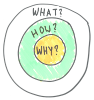

**A good part of leadership is to bring inspiration and purpose to people in order to motivate them do get things done.** In modern companies job no longer falls to a single boss-leader, but situational, decentralized leadership is the way to go. In essence "whoever knows best" leads the way.
In the book [Start with Why](https://simonsinek.com/product/start-with-why/?ref=home) and a [TED talk](https://www.ted.com/talks/simon_sinek_how_great_leaders_inspire_action?language=en), the author Simon Sinek describes what he calls the "golden circle" as a model to create purpose and inspiration. In the tiniest nutshell the method consists of three concentric rings, "Why" (innermost), "How" and "What" (outermost) and these questions get answered inside out. 

* Why are we doing this?
* How are we going about to bring this 'thing' into live? 
* What actions are we taking and what things are we creating to bring the change?

Obviously the answers to "Why?", "How?", "What?" do not appear out of thin air most of the time. Especially for more complex matters there is often a quite complicated social and factual dynamics at work to find the answers. And whenever it gets complicated, people involved start looking for leadership figures to help them to find the way.
In traditional companies this was usually the manager or boss, but as we strife to more sociocratic organizations and as knowledge work increases, it is very unlikely that there exists a single person bringing all the necessary knowledge and expertise to the table. The challenge in decentralized, situational leadership is often to find whoever is leading - or in other words "who knows best". Looking at the progression through the golden circle, we find a few hints on what knowledge and skills to look for at any given time.  

## Leading the 'Why' 

"Why are we even doing what we doing?" sounds philosophical, but teams and organizations that can answer this question satisfactorily tend to display higher motivation and better internal alignment. Finding this answer is often tricky and in order to lead such an answering process a leader has to display **content expertise** often also called **domain knowledge** about the subject at hand. This does not mean knowing all the nitty-gritty detail of a possible implementation or solution, but having a deeper understanding of the **problem context**. The "Why" is all about recognizing and creating context, so creative thinking and having the ability to look at problems from outside of the box helps tremendously. 
In companies this can be knowledge about the market or users or being the driver behind a [good company vision]({{site.base_url}}/a-good-product-vision/). Traditionally in small companies and startups this is often one of the founders, in bigger more companies and large firms this knowledge often lies with middle to upper management. But do not be afraid to look outside of these circles to find a hidden champion for leading this. It is often surprising on how much of the "Why" - or the lack of answer to that - is discussed in the everyday conversations across all company hierarchies. 

## Leading the 'How'

Once the "why" is fairly established bringing up the "how" - often in the form of a plan and methods - is the next to solve. Naturally whoever emerges as a leader in this part has to have a good method competence and process knowledge to formulate such a plan. Typical questions here are who to bring on board at what point, how to facilitate communication and breaking down the big "Why"-problems into smaller chunks. Leading the how has high demands on facilitation skills as well, because defining the how often raises more questions that help sharpening the "why" on one side and the "how" sets constraints on the "what" i.e. the implementation. Leading the how has often a more managerial component than leading the other two circles. 

## Leading the 'What' 

Here one gets down to business and gets the hands dirty with actually implementing things. Leading this part of course needs close collaboration an awareness about the "Why" and "What" but even more so it needs expertise and specialist knowledge. Finding the right solution to the problems posed requires an in-depth knowledge of the mechanics involved. The main task of the "what" is finding and implementing solutions, so a leader of the "what@ should be able to sketch out a feasible solution to the problem and be able to hold a critical dialog about the implementation details of it. 
Ideally leading the implementation means being placed into a tight feedback loop for observing if the actions taken are having the desired effect. If such a feedback loop does not exist yet or is too weak building them for the people working on the what is an essential task here. 

## Who can do that? 

The bigger the problems and issues faced, the less likely it is that one single person can lead across the whole circle, but having people who can at least partially take leadership in the different rings is a big plus. The borders between the rings are fuzzy and thinking in one ring will affect the others as well, so creating artificial borders or even stage gates between the three is a bad idea. Frequent "broadband" communication on an eye-level across all rings is essential. But being aware that the different questions require a different credibility in different areas of knowledge will help driving the the acceptance of solutions in the people affected by any change. Being able to explicitly state in which rings a discussion takes place and being aware what kind of knowledge has the most weight here will help finding the right people to lead or building the missing skills to bring change about. 

---

* Why: Content expertise, experience, bigger context
* How: Method competence, process knowledge
* What: Technical expertise