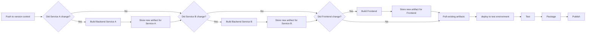

**CI/CD pipelines are a standard part of many software development workflows.** However, many teams still struggle with long build times, flaky tests and inefficient workflows. Apart from driving the cost of CI up, these issues can lead to frustration and reduced productivity up to quality issues as developers may not run the full test suites before deploying their changes. One approach to address these challenges is to use artifact based CI, which can significantly improve the efficiency and reliability of your CI/CD pipelines.

## What is Artifact Based CI?

Let's look at a typical CI/CD pipeline: When a developer pushes code changes, the CI system triggers a build process that compiles the code, runs tests, and produces artifacts (e.g., binaries, libraries, documentation). In a traditional setup, every time a change is pushed, the entire build process is executed from scratch, which can be time-consuming and resource-intensive.

<figure markdown="0">

<figcaption>
  A very high level view of a typical, trivial CI/CD pipeline
</figcaption>
</figure>

For a simple and small project such a straight forward pipeline is all what it takes. However if projects grow larger and contain multiple components, the build process can become complex and time-consuming. This is where artifact based CI comes into play. A slightly more complicated example might be an application that consists of a frontend and several backend services. A trivial approach to CI/CD would be to build all the services from scratch on every change, then deploy all together to a test-environment, run the tests and if successfully deploy to the target system. 

<figure markdown="0">

<figcaption>
  A more complex CI/CD pipeline with multiple components
</figcaption>
</figure>

Since the backend services and the frontend should be deployable individually, building everything from scratch, even if only a part of the code has changed is wasteful. Also, if for example only the frontend changes, running the full backend build and test process is not necessary. So to optimize this, we can introduce artifact based CI.

Artifact based CI is a practice where the output of your build process (the artifacts) are stored and reused in subsequent builds. This means that instead of rebuilding everything from scratch every time, you can leverage previously built artifacts, which can save a lot of time and resources.

If done right, artifact based CI can not just speed up your builds and increase the reliability of your CI/CD pipelines, but they are also a great way to test deployment processes on the go. By deploying the same artifacts that will be used in production, you can catch deployment issues early in the development process.

The same pipeline as before, but now with artifact based CI could look like this:

<figure markdown="0">

<figcaption>
  The same pipeline as before, but now with artifact based CI
</figcaption>
</figure>

Since the backend services and the frontend should be deployable individually, building everything from scratch, even if only a part of the code has changed is wasteful. Also, if for example only the frontend changes, running the full backend build and test process is not necessary. So to optimize this, we can introduce artifact based CI. 

Artifact based CI is a practice where the output of your build process (the artifacts) are stored and reused in subsequent builds. This means that instead of rebuilding everything from scratch every time, you can leverage previously built artifacts, which can save a lot of time and resources. 

If done right, artifact based CI can not just speed up your builds and increase the reliability of your CI/CD pipelines, but they are also a great way to test deployment processes on the go. By deploying the same artifacts that will be used in production, you can catch deployment issues early in the development process.

The same pipeline as before, but now with artifact based CI could look like this:



Core concepts: 

* Build artifacts and store them somewhere
  * Caching for dev builds and branches, permananent storage for production builds
  * Reusing artifacts in subsequent builds
* Finding the right artifact - 
  * Versioning, naming conventions, metadata, build numbers etc.
  * use convention to find the right artifact
* more complex test setups are set up using the artifacts (i.e. deploy to a staging or test environment)
* Different flavors of artifacts 
    * Coverage build, tracing, optimized, debug builds etc.
    * Deploy artifacts interchangeable depending on need (i.e. frontend coverage, backend optimized, etc.)
* Ideally artifacts are the same kind as the ones used in production
    * bonus is that deployment of the app is inherently tested
    * Installations or full packages? 
