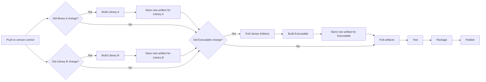

author: Dominik

**CI/CD pipelines are a standard part of many software development workflows.** However, many teams still struggle with long build times, flaky tests and inefficient workflows. Apart from driving the cost of CI up, these issues can lead to frustration and reduced productivity up to quality issues as developers may not run the full test suites before deploying their changes. One approach to address these challenges is to use artifact based CI, which can significantly improve the efficiency and reliability of your CI/CD pipelines.

## What is artifact based CI?

Let's look at a typical CI/CD pipeline: When a developer pushes code changes, the CI system triggers a build process that compiles the code, runs tests, and produces artifacts (e.g., binaries, libraries, documentation). In a traditional setup, every time a change is pushed, the entire build process is executed from scratch, which can be time-consuming and resource-intensive.

<figure markdown="0">

<figcaption>
  A very high level view of a typical, trivial CI/CD pipeline
</figcaption>
</figure>

For a simple and small project such a straight forward pipeline is all what it takes. However if projects grow larger and contain multiple components, the build process can become complex and time-consuming. This is where artifact based CI comes into play. A slightly more complicated example might be an application that consists of several modules, such as an executable and several libraries, where the executable depends on the libraries. A trivial approach to CI/CD would be to build all the libraries from scratch on every change, then deploy all together to a test-environment, run the tests and if successfully, package them and publish them somewhere or deploy them to the target systems. 

<figure markdown="0">

<figcaption>
  A more complex CI/CD pipeline with multiple components
</figcaption>
</figure>

Since the libraries and the executable should be buildable individually, building everything from scratch, even if only a part of the code has changed is wasteful. Also, if for example only code in the executable changes, running the full library build and test process is not necessary. So to optimize this, we can introduce artifact based CI.

Artifact based CI is a practice where the output of your build process (the artifacts) are stored and reused in subsequent builds. This means that instead of rebuilding everything from scratch every time, we can leverage previously built artifacts, which can save a lot of time and resources.

If done right, artifact based CI can not just speed up your builds and increase the reliability of your CI/CD pipelines, but they are also a great way to test deployment processes on the go. By deploying the same artifacts that will be used in production, you can catch deployment issues early in the development process.

The same pipeline as before, but now with artifact based CI could look like this:

<figure markdown="0">

<figcaption>
  The same pipeline as before, but now with artifact based CI
</figcaption>
</figure>

Wow, this looks a lot more complicated, but let's break it down a bit. The first thing introduced here is some form of decision making to determine whether a component has changed or not. This can often be done by checking the version control systems for changes in the relevant files or directories. What we also need is a way to store the artifacts produced by the build process. Many CI/CD systems such as github actions or gitlab pipelines offer a simple way to store and retrieve build outputs, but for more complex applications a dedicated artifact repository, such as JFrog Artifactory, Nexus Repository might be better suited. The key is to ensure that the artifacts are versioned and easily retrievable. 
The last thing to notice is that this already gives us a way to speed up the build process, even if we need to build everything from scratch, because we can parallelize the jobs for building the libraries. 

When moving to artifact based CI, the central problem usually revolves around how to efficiently store and retrieve the artifacts, how to version them properly, and how to ensure that the right artifacts are used in the right places.

### Finding the right artifact

The core concept of artifact based CI rotates around storing and retrieving build artifacts efficiently. Looking a bit closer this the main problem to be solved is that we need to find the right artifact for the current build. So putting up a good versioning and naming scheme is crucial. In a typical workflow we have three kind of versions of artifacts that we need to consider:

* **Development builds**: These are the artifacts produced during the development process, often for branches or pull requests. Typically, these builds are only used by a small group of developers (or even a single one) working on a specific feature or bug fix. They are usually stored temporarily and can be discarded after a certain period of time or when the feature is merged into the main branch.

* **Released builds**: These are the artifacts that are deployed to production environments. They should be stored permanently and should be easily retrievable.

* **Staged builds**: These are the artifacts used for testing purposes, such as staging or QA environments. They can be a mix of development and production builds, depending on the testing requirements. If all goes well, these artifacts might be promoted to production builds or discarded if newer artifacts are available. 

The naming and versioning of the artifacts should reflect these different stages. A common approach is to use semantic versioning, where the version number consists of three parts: major, minor, and patch. For example, a development build might be named `myapp-1.0.0-dev-123`, where `123` is a build number, a commit hash, or a branch name (or a combination of all of them). A released build might be named `myapp-1.0.0`, and a staged build might be named `myapp-1.0.0-staging`. 

This way it is easy to identify where an artifact comes from and what it is used for. If building for multiple platforms or configurations, the naming scheme can be extended to include the platform and configuration, such as `myapp-1.0.0-linux-x86_64`, `myapp-1.0.0-windows-x86_64`, etc.

For a start, a simple storage solution for these artifacts might be enough, but as the project grows, it is worth considering a dedicated artifact repository and a [package manager](https://softwarecraft.ch/conan-as-cmake-dependency-provider/) to handle the artifacts. If you have the versioning and naming scheme covered, you are already a huge step further towards efficient artifact-based CI, and further improvements can usually be made incrementally.



## Further improvements

Moving from a build-everything-all-the-time approach to an artifact-based CI approach can be a bit of a paradigm shift, but it can lead to significant improvements in build times and reliability. Once the CI pipeline is set up to handle artifacts, the door is open to further optimizations, such as caching dependencies, parallelizing builds, and more. Depending on the team's setup, it can even be beneficial to make the artifacts available to developers locally, so they can test their changes against the same artifacts that will be used in production. 

As always, the key is to start somewhere and iterate and improve over time. Shifting to artifact-based CI is a great step towards more efficient and reliable CI/CD pipelines, and it can help teams to focus on delivering value rather than dealing with long build times and waiting for feedback.

