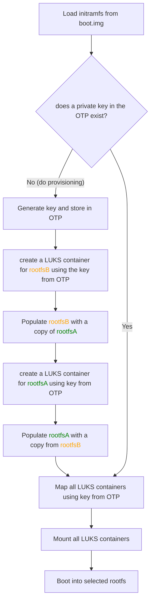

--- 
layout: post
title: "Encryption at Rest for a Raspberry Pi using Yocto"
description: "Implement LUKS encryption at rest on Raspberry Pi CM4 with yocto. Complete guide covering initramfs, cryptsetup, OTP keys, and self-provisioning setup."
image: /images/encryption-at-rest/encryption_at_rest_thumb.jpg
hero_image: /images/encryption-at-rest/encryption_at_rest.jpg
hero_darken: true
tags: secure-boot yocto embedded-linux
lang: en
author: Dominik Berner
---



**As embedded devices store more and more sensitive data, encryption-at-rest becomes a critical requirement.** Especially for devices that are publicly accessible or deployed in untrusted environments, protecting data while the device is powered down is essential. Together with [secure boot](https://softwarecraft.ch/secure-boot-yocto/), **encryption at rest** ensures that data stored on the device remains confidential and tamper-proof, even if the device is physically compromised. This article describes how to implement LUKS encryption for embedded Linux devices based on the [Raspberry Pi Compute Module 4](https://www.raspberrypi.com/products/compute-module-4/?variant=raspberry-pi-cm4001000) using the yocto Project.

## Encryption at rest in embedded Linux in a nutshell

On a high level, *encryption at rest* means that all data stored on the device is encrypted when the device is powered off. This ensures that if an attacker gains physical access to the device, they cannot read the data without the encryption key. In practice, this is typically achieved by encrypting the root filesystem and any other sensitive partitions using a strong encryption algorithm such as AES. When the device boots up, the encryption key is retrieved from a secure location (e.g. One-Time Programmable memory (OTP)) and used to unlock the encrypted partitions, allowing the operating system to access the data as needed. While this adds some complexity to the boot process and comes with a slight performance overhead for I/O operations, the security benefits far outweigh these drawbacks for most applications.

In practice for embedded Linux devices, encryption at rest can be implemented using [LUKS](https://en.wikipedia.org/wiki/Linux_Unified_Key_Setup) (Linux Unified Key Setup), which is a widely used disk encryption specification for Linux. The tool to manage LUKS encrypted partitions is [`cryptsetup`](https://gitlab.com/cryptsetup/cryptsetup) and is well supported in the Linux kernel through the [dm-crypt](https://en.wikipedia.org/wiki/Dm-crypt) kernel module. 

Let's look at how these steps can be implemented in detail with yocto.

## Creating a LUKS-encrypted root filesystem with yocto

To implement encryption at rest using LUKS on embedded Linux devices based on the Raspberry Pi Compute Module 4 with the yocto Project, the following steps are necessary:

* Create an initramfs image that includes the `cryptsetup` tool and any necessary dependencies.
* Modify the bootloader configuration to load the initramfs image during the boot process.
* Create an init script within the initramfs that handles the unlocking of the LUKS-encrypted root filesystem using the encryption key stored in OTP memory.
* Implement a provisioning process during the first boot to create the LUKS-encrypted root filesystem and store the encryption key in OTP memory.



Since the encryption of the partitions is device specific and needs to be done only once, a provisioning process is required during the first boot of the device. As a consequence, the device image created from yocto is unencrypted initially and will only be encrypted during the provisioning process. A convenient way to achieve this is to use an A/B partition scheme, where one partition is used for provisioning and the other for normal operation. During the first boot, the init script generates a unique encryption key for the device, creates the LUKS-encrypted root filesystem, copies the unencrypted root filesystem into the encrypted container, and stores the encryption key in OTP memory. On subsequent boots, the init script retrieves the encryption key from OTP memory and unlocks the LUKS-encrypted root filesystem for normal operation. So the init script needs to handle two scenarios: the first boot (provisioning) and subsequent boots (normal operation). 

But first of all, the initramfs image needs to be created and the bootloader configuration modified.

### Create initramfs with cryptsetup

Since the initramfs is just a minimal Linux image, we can create it using yocto by defining a custom image recipe. The image recipe should include the `cryptsetup` package and any other necessary dependencies. Here is an example of how to create an initramfs image with `cryptsetup`. Let's call this recipe `initramfs-cryptsetup.bb`:

```bash
inherit core-image

PACKAGE_INSTALL = "provisioning-initramfs-init cryptsetup e2fsprogs rsync userland openssl rpi-eeprom"

IMAGE_FEATURES = ""

PACKAGE_EXCLUDE = "kernel-image-*"

IMAGE_FSTYPES = "${INITRAMFS_FSTYPES}"

INITRAMFS_MAXSIZE = "262144"

do_install_bootfiles() {
    
    install -m 644 ${IMGDEPLOYDIR}/${IMAGE_BASENAME}-${MACHINE}.cpio.gz ${DEPLOY_DIR_IMAGE}/bootfiles/initramfs.cpio.gz
    
}

addtask do_install_bootfiles after do_image_cpio before do_image_complete
```

If we look at this a bit closer, we can see that the image recipe inherits from `core-image`, which provides a basic image structure. The `PACKAGE_INSTALL` variable specifies the packages to be included in the initramfs image, including `cryptsetup` for LUKS support `provisioning-initramfs-init`, which is our custom package that contains the init script for handling the unlocking of the LUKS-encrypted root filesystem.  Additionally, other necessary packages such as `e2fsprogs`, `rsync`, `userland`, `openssl`, and `rpi-eeprom` are included to support various functionalities required for the provisioning process, create the encryption keys and store them in the OTP memory of the Raspberry Pi CM4.
Since the initramfs is intended to only run the provisioning and unlocking process, we exclude the kernel image packages by setting the `PACKAGE_EXCLUDE` variable to `kernel-image-*`. The `IMAGE_FSTYPES` variable is set to `${INITRAMFS_FSTYPES}` to specify the desired initramfs file types (e.g., cpio.gz). The `INITRAMFS_MAXSIZE` variable is set to `262144` (256MB) to define the maximum size of the initramfs image. `IMAGE_FEATURES` is deliberately left empty to avoid including unnecessary features in the initramfs image.
The `do_install_bootfiles` function installs the generated initramfs image to the appropriate location for the bootloader to access it during the boot process. 

Next we need to make sure that this initramfs image is loaded by the bootloader during the boot process.

### Modify bootloader configuration to load initramfs

To modify the bootloader configuration to load the initramfs image during the boot process, we need to update the bootloader settings to include the initramfs image. For Raspberry Pi devices, this is typically done by modifying the `config.txt` file located in the boot partition. In the case of the Raspberry Pi recipes this can be achieved by modifying the `RPI_EXTRA_CONFIG` variable in the machine configuration file (e.g., `raspberrypi4.conf` or `raspberrypi-cm4.conf`). Here is an example of how to modify the bootloader configuration to load the initramfs image:   

```bash
RPI_EXTRA_CONFIG += "
...
initramfs initramfs.cpio.gz\n\
..."
```

This tells the bootloader to load the specified initramfs image (`initramfs.cpio.gz`) during the boot process, but it is only half the story. To make this accessible, we also need to make sure that the initramfs image is copied to the `boot.img` container during the image creation process. If your distribution is not yet using secure boot, I suggest to implement this first. Here is a [step by step guide for secure boot using yocto](https://softwarecraft.ch/secure-boot-yocto/). 

In the recipe creating the `boot.img` we need to add the dependency to our initramfs image and copy it into the boot image. Here is an example of how to do this:

```bash

inherit deploy nopackages

DEPENDS += "rpi-bootfiles rpi-cmdline rpi-config linux-raspberrypi dosfstools-native mtools-native initramfs-cryptsetup"

# The raspberry pi bootloader files are located in the following directories
BOOTFILES_DIR = "${WORKDIR}/bootfiles" 
DTBO_DIR = "${DEPLOY_DIR_IMAGE}"

S = "${WORKDIR}/boot-img-container"

do_compile() {
    ...
   # Create boot.img file code, omitted for brevity here
   ...
}

do_compile[depends] += "initramfs-cryptsetup:do_install_bootfiles"

```

By adding the `initramfs-cryptsetup` dependency to the `DEPENDS` variable, we ensure that the initramfs image is built before the `boot.img` is created. The `do_compile[depends]` line ensures that the initramfs image is installed to the bootfiles directory before creating the `boot.img`. With these modifications and together with the modifications of the `RPI_EXTRA_CONFIG` variable, the initramfs will be included in the `boot.img` and loaded by the bootloader during the boot process. At this point we have everything in place to start looking at how the unlocking of the LUKS-encrypted root filesystem during boot and the provisioning process during the first boot can be implemented.

### Init script for unlocking LUKS-encrypted root filesystem

Inside the initramfs there is an init script, which is a shell script that runs during the initramfs stage of the boot process. In our case, the init script is responsible for handling both the provisioning process during the first boot and the normal unlocking process during subsequent boots. First we create a new recipe for placing the init script inside the initramfs-image, let's call it `provisioning-initramfs-init.bb`:

```bash
SRC_URI = "file://provisioning-initramfs-init"

# Installs shell and binaries required for the initscript
RDEPENDS:${PN} += "${VIRTUAL-RUNTIME_base-utils}"

do_install() {
    # Install the init script itself
    install -m 0755 ${WORKDIR}/provisioning-initramfs-init ${D}/init
    # Kernel will panic if /dev doesn't exist
    install -d ${D}/dev
    # Required for logging to work
    mknod -m 622 ${D}/dev/console c 5 1

    # Add the mount points
    install -d ${D}/mnt
}

FILES:${PN} = "/init /dev/console /proc /sys /mnt"
```

This recipe is included in the initramfs image by adding it to the `PACKAGE_INSTALL` variable in the `initramfs-cryptsetup.bb` recipe as shown earlier. The actual init script (`provisioning-initramfs-init`) contains the logic for both the provisioning and normal unlocking processes. Additionally, it creates the `/dev` directory and the `/dev/console` device to allow for logging over uart, but this is mainly for debug purpose.

So far we have set up the initramfs image with the necessary tools and created a recipe to include the init script. But this does not yet cover the actual logic for unlocking the LUKS-encrypted root filesystem and the provisioning process. Let's look at how this can be implemented in the init script.

#### The init script

The init script is a shell script that runs during the initramfs stage of the boot process. In our case it it checks whether the device has been provisioned (i.e., whether the LUKS-encrypted root filesystem has been created and the encryption key stored in OTP memory). If not, it performs the provisioning process; otherwise, it retrieves the encryption key from OTP memory and unlocks the LUKS-encrypted root filesystem for normal operation. 

The following flowchart illustrates the provisioning and boot process:



The path for already provisioned devices is quite straight forward: Retrieve the encryption key from OTP memory, map the LUKS containers using `cryptsetup`, mount the root filesystem, and call `switch_root` to boot into the LUKS-encrypted root filesystem.

The provisioning process is more complex and requires several steps to create the LUKS-encrypted root filesystem and store the encryption key in OTP memory. Our script will perform the following steps during the provisioning process:

1. Detect if the device is already provisioned by checking if the encryption key is present in OTP memory and if the root filesystem partitions are already LUKS encrypted.
2. Generate a unique encryption key for the device using a secure random number generator.
3. Store the generated encryption key in the One-Time Programmable (OTP) memory of the Raspberry Pi CM4 using the appropriate tools (e.g., `rpi-eeprom`).
4. Create a LUKS-encrypted container for the root filesystem using the generated encryption key.
5. Copy the unencrypted root filesystem into the LUKS-encrypted container. 
6. Boot into the newly created LUKS-encrypted root filesystem.

One question to clarify is where to store the unencrypted root filesystem before the provisioning process. Since LUKS does not support in-place encryption of existing filesystems, we need to have the unencrypted root filesystem available somewhere during the first boot. If you are using an A/B partition scheme, you can store the unencrypted root filesystem in one of the partitions (e.g., partition A) and use the other partition (e.g., partition B) for the LUKS-encrypted root filesystem. During the provisioning process, the init script can copy the unencrypted root filesystem from partition A into the LUKS-encrypted container on partition B and then do the same vice versa from the now encrypted B partition to A. While this complicates the init script somewhat, it streamlines the provisioning process significantly, as no external media is required to provide the unencrypted root filesystem during the first boot and the entire image can be flashed at once using `.wic` images or similar.

So let's look at the key commands that need to be executed in the init script for both the provisioning and normal unlocking processes.

#### Provisioning and boot process

First we need to check if the device is already provisioned. The simplest way to do this is to check if all partitions are already LUKS encrypted and if there is a non-zero key stored in OTP memory. 
If the OTP key is not set, we need to generate a new encryption key and store it in OTP memory. The RPI eeprom tools provide a convenient way to do this:

```bash
rpi-otp-private-key -w $(openssl rand -hex 32) -y
```

If the key is either generated or already present in OTP memory, we read it out and store it in a temporary key file for use with `cryptsetup`:

```bash
rpi-otp-private-key -r > /keyfile.bin
# in case the private key is only zeroes, the file is not created
if [ ! -f /keyfile.bin ] || [ ! -s /keyfile.bin ]; then
    echo "[initramfs] FATAL ERROR: OTP private key file /keyfile.bin missing or empty. This is fatal!"
    exec /bin/sh
fi
```

Note, that on error we drop into a shell for debugging purposes, but in a production system you might want to `reboot -f` or take halt the system entirely to avoid leaving the device in an inconsistent or vulnerable state. 

> ⚠️ Dropping into a shell on error is dangerous for production systems. Use with caution and only for debugging purposes. ⚠️

Next we check if the root filesystem partitions are already LUKS encrypted or need to be provisioned. Here is an example of how to do this:

```bash
ROOTFS_A="/dev/mmcblk0p5"   # rootfs_A
ROOTFS_B="/dev/mmcblk0p6"   # rootfs_B
OTP_KEY_SET=false
rpi-otp-private-key -c && OTP_KEY_SET=true
cryptsetup isLuks "${ROOTFS_B}" || { [ "${OTP_KEY_SET}" = false ] && ROOTFS_B_NEEDS_SETUP=true; }
cryptsetup isLuks "${ROOTFS_A}" || { [ "${OTP_KEY_SET}" = false ] && ROOTFS_A_NEEDS_SETUP=true; }
```

The `rpi-otp-private-key -c` command stems from the `rpi-eeprom` yocto recipe and checks if a private key is stored in OTP memory. If the OTP is non-zero, it returns 0 else 1. We use this to set the `OTP_KEY_SET` variable accordingly. Next we check if the rootfs partitions are LUKS containers with the `cryptsetup isLuks` command. If either of the rootfs partitions is not a LUKS container and the OTP key is not set, we mark that partition as needing setup. 


For this we create two helper functions: `set_up_luks_partition` and `provision_luks_partition`. The first function creates the LUKS container on the specified partition, while the second function copies the unencrypted root filesystem into the LUKS container and stores the encryption key in OTP memory. Here is an example implementation of these functions:


```bash
set_up_luks_partition(){
    target_partition="$1"
    mapping_name="$2"

    echo "[initramfs] Setting up LUKS on ${target_partition}..."
    cryptsetup luksFormat "${target_partition}" --batch-mode --key-file /keyfile.bin || {
        echo "[initramfs] ERROR: Failed to format LUKS partition ${target_partition}."
        exec /bin/sh
    }

    echo "[initramfs] formatting ${target_partition} to ext4."

    cryptsetup luksOpen ${target_partition} ${mapping_name} --key-file /keyfile.bin || {
        echo "[initramfs] ERROR: Failed to open LUKS partition ${target_partition}."
        exec /bin/sh
    }   

    mkfs.ext4 /dev/mapper/${mapping_name} || {
        cryptsetup luksClose ${mapping_name}
        echo "[initramfs] ERROR: Failed to format LUKS partition ${target_partition}."
        exec /bin/sh
    }

    
    cryptsetup luksClose ${mapping_name}
    echo "[initramfs] LUKS partition ${target_partition} is set up and ready."
}
```

First, the `set_up_luks_partition` function takes two arguments: the target partition to be encrypted and the mapping name for the LUKS container. It uses `cryptsetup luksFormat` to create the LUKS container on the specified partition, using a predefined key file (`/keyfile.bin`) for simplicity. After creating the LUKS container, it opens it with `cryptsetup luksOpen`, formats it to ext4 using `mkfs.ext4`, and then closes the LUKS container. If any of these steps fail, an error message is printed, and the system reboots. However depending on where things go wrong this might leave you with a bricked device, so be careful when testing this!

Once the LUKS container is set up, we can proceed to the provisioning process with the `provision_luks_partition` function:

```bash
provision_luks_partition() {
    target_partition="$1"
    mapping_name="$2"
    source_partition="$3"

    echo "[initramfs] Opening LUKS partition ${target_partition}..."
    cryptsetup luksOpen ${target_partition} ${mapping_name} --key-file /keyfile.bin || {
        echo "[initramfs] ERROR: Failed to open LUKS partition ${target_partition}."
        exec /bin/sh
    }   

    echo "[initramfs] mounting ${mapping_name} to /mnt/target."
    mkdir -p /mnt/target
    mount /dev/mapper/${mapping_name} /mnt/target || {
        cryptsetup luksClose ${mapping_name}
        echo "[initramfs] ERROR: Failed to mount LUKS partition ${target_partition}."
        exec /bin/sh
    }
    mkdir -p /mnt/src
    mount ${source_partition} /mnt/src || {
        
        umount /mnt/target
        cryptsetup luksClose ${mapping_name}
        echo "[initramfs] ERROR: Failed to mount source partition ${source_partition}."
        exec /bin/sh
    }

    echo "[initramfs] Copy everything from ${source_partition} (/mnt/src) to /mnt/target using rsync."
    rsync -aHAXx /mnt/src/ /mnt/target/ || {
        umount /mnt/target
        cryptsetup luksClose ${mapping_name}
        echo "[initramfs] ERROR: Failed to copy data from /mnt/src to /mnt/target."
        exec /bin/sh
    }

    umount /mnt/target
    umount /mnt/src
    cryptsetup luksClose ${mapping_name}

}
```

The `provision_luks_partition` function takes three arguments: the target partition to be provisioned, the mapping name for the LUKS container, and the source partition containing the unencrypted root filesystem. It opens the LUKS container on the target partition, mounts it to `/mnt/target`, and mounts the source partition to `/mnt/src`. It then uses `rsync` to copy all data from the source partition to the target LUKS-encrypted partition. After the data transfer is complete, it unmounts both partitions and closes the LUKS container. If any step fails, an error message is printed, and the system reboots.

We then can use these functions to handle the provisioning process during the first boot. Here is an example of how to use these functions in the init script:
```bash

if [ "${ROOTFS_B_NEEDS_SETUP}" = true ]; then
    set_up_luks_partition ${ROOTFS_B} "rootfs_b" 
    provision_luks_partition ${ROOTFS_B} "rootfs_b" ${ROOTFS_A}
    
else
    echo "[initramfs] Rootfs_B partition ${ROOTFS_B} is already LUKS formatted. Skipping setup and provisioning."
fi

# Create a LUKS container for mmcblk0p5 (rootfs_A) if needed
if [ "${ROOTFS_A_NEEDS_SETUP}" = true ]; then
    echo "[initramfs] Rootfs_A partition ${ROOTFS_A} is not LUKS formatted. Setting up LUKS."
    set_up_luks_partition ${ROOTFS_A} "rootfs_a"
    # map rootfsb to copy data from it
    cryptsetup luksOpen ${ROOTFS_B} "rootfs_b" --key-file /keyfile.bin || {
        echo "[initramfs] ERROR: Failed to open LUKS partition ${ROOTFS_B}."
        exec /bin/sh
    }
    provision_luks_partition ${ROOTFS_A} "rootfs_a" "/dev/mapper/rootfs_b"
    cryptsetup luksClose "rootfs_b"
else
    echo "[initramfs] Rootfs_A partition ${ROOTFS_A} is already LUKS formatted. Skipping setup and provisioning."
fi
```

Note that while the first provisioning is done from an unencrypted partition to an encrypted one, the second provisioning is done from an already encrypted partition to another encrypted partition. For this we need to open the source LUKS container first and use the mapped device as source for the `provision_luks_partition` function.

Once the provisioning process is complete, we can proceed to unlock the LUKS-encrypted root filesystem for normal operation during subsequent boots. Here is an example of how to do this in the init script, for simplicity let's say always into rootfs_A:

```bash
cryptsetup luksOpen ${ROOTFS_A} rootfs_a --key-file /keyfile.bin || {
    echo "[initramfs] ERROR: Failed to open LUKS partition ${ROOTFS_A}."
    exec /bin/sh
}
mount /dev/mapper/rootfs_a /mnt/rootfs || {
    cryptsetup luksClose rootfs_a
    echo "[initramfs] ERROR: Failed to mount LUKS partition ${ROOTFS_A}."
    exec /bin/sh
}
```

At this point, the LUKS-encrypted root filesystem is unlocked and mounted to `/mnt/rootfs`, allowing the normal boot process to continue.

Finally, we need to switch to the unlocked root filesystem and continue the normal boot process. This can be done using the `switch_root` command:

```bash
exec switch_root /mnt/rootfs /sbin/init
```

At this point, the init script has completed its tasks, and the normal boot process continues from the unlocked LUKS-encrypted root filesystem. 

## Conclusion

Getting an embedded device to support encryption at rest may look daunting at first, but as illustrated yocto makes it relatively straightforward to create the necessary initramfs image and modify the bootloader configuration. The more complex part is the provisioning process during the first boot, which requires careful handling of encryption keys and data transfer. While such a self-provisioning process may be comfortable to use, it might come with some security implications. First of all, until the provisioning is done, the unencrypted root filesystem is present on the device, which means that an attacker with physical access to the device could potentially read and modify the unencrypted data before the provisioning process is complete. Additionally, the provisioning process itself involves copying data from an unencrypted partition to an encrypted one, which could be vulnerable to interception or tampering if not properly secured. Therefore, it is crucial to ensure that the provisioning process is executed in a secure environment and that appropriate measures are taken to protect the unencrypted data during this phase. Using an external source to pull the unencrypted root filesystem during provisioning could mitigate some of these risks, but it also adds complexity to the provisioning process.

Another concern is that the provisioning code is still present in the initramfs even after the device has been provisioned. An attacker who gains access to the device could potentially exploit vulnerabilities in the provisioning code to compromise the security of the encrypted root filesystem. To mitigate this risk, it is advisable to implement a mechanism to disable or remove the provisioning code from the initramfs after the first successful boot and provisioning process. If your device supports update mechanisms, you could push an updated initramfs without the provisioning code after the first boot. 

Despite these considerations, implementing encryption at rest using LUKS on embedded Linux devices based on the Raspberry Pi Compute Module 4 with the yocto Project provides a robust solution for protecting sensitive data and will make exploiting the device significantly harder, even if an attacker has physical access.

