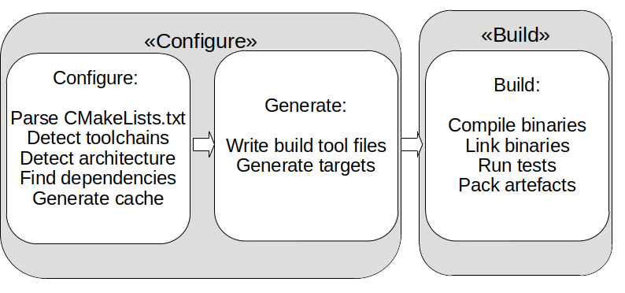
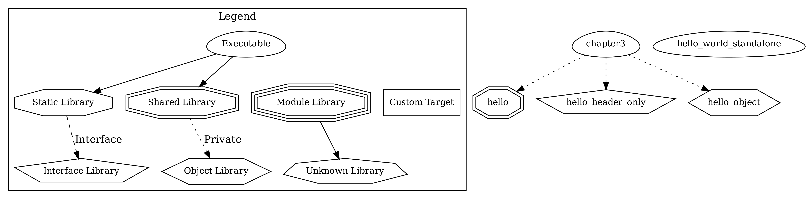
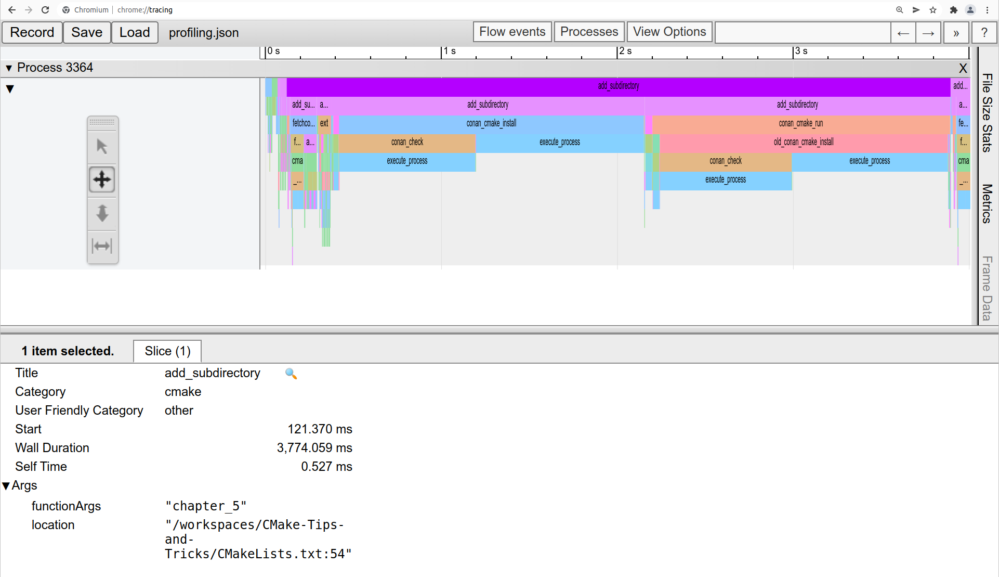

name: title
layout: true
class: center, middle, inverse

.footer[ [ @BernerDominik](https://twitter.com/BernerDominik)]
---

CMake best practices
===


### Dominik Berner

???

# Welcome

* ask about experience with CMake 

---

# Dominik Berner

### C++ Coder, Agilist & Rock Climber
.left-column[
 
]
.right-column[
.left[
[ dominikberner.me](http://dominikberner.ch)

[ @BernerDominik](https://twitter.com/BernerDominik)

[ bernedom](https://github.com/bernedom)

[ dominik.berner@bbv.ch](mailto:dominik.berner@bbv.ch)
]
]
 

???

Brainstorm:

book plug 1 slide


* Presets - possible a bigger one by itself - OK
  * CMakePresets.json and CMAkeUserPrestes.json
  * Presets and cross compiling using toolchains 
  * inheriting 
* Cmake in script mode for platform independent commands -OK
* Test orchestration
  * test grouping/test parallization
  * test timeouts
  * test ressources 
  * defining fixtures 
  * Running tests in an emulator when cross compiling

* speeding up cmake 
  * cmake profiling - OK
  * unity builds
  * precompiled headers 
  * ccache
* CMake dependency graphs -OK
* DLL Symbol visibility
  * SHARED STATIC defined by preset -OK
* Dependency management
  find_package to rule them all
  * Upstream over find_package over FetchContent/ExternalProject

Small but useful
* export compile commands
* No ${PROJECT_NAME} targets - semantically different meaning - Kill the thing - OK

* Generator expressions - Explained

* custom commands / custom targets dependent on each other

* ccache
* sanitizers etc
  * Custom build types
  * Code coverage 
  * static code analysis (iwyu)

* Search order for sysroots (setting BOTH etc) - individual programs
* toolchain checks (very advanced) - NO

* Packaging and installing
* Q&A 


* ccmake and cmake-gui (console yay)
  * Tweaking environment variables
* conan integration instead of fetch content


---

CMake in a nutshell
===

.left[
* CMake is a build-system generator or meta-build-system
* **Inputs**: source files, compiler-toolchain, build-environments and logical build targets 
* **Outputs**: instructions for build-systems (make, ninja, visual studio, xcode) 
* Additional features include running tests, static code analysis, packaging and installing
]




---

CMake Best Practices - The book
===

.left-column[
 
]
.right-column[
.left[
Get it from [packt](https://www.packtpub.com/product/cmake-best-practices/9781803239729)
QR Code
10% voucher
]
]


---

A minimal CMakeLists.txt
===

.left[

```CMake

project(myProject VERSION 1.0.0 LANGUAGES CXX)

add_library(myLib lib.cpp)

add_executable(myProject maAin.cpp)

target_link_libraries(myProject PRIVATE myLib.cpp)

```
]

---

General good practice
===

.left[

1. **Platform-agnostic `CMakeLists.txt`**
1. presets > toolchain files > command line > env variables.
1. Leave decision for shared or static libraries to the user. 
1. Favor `add_subdirectory` over `include`.
1. Use `target_*` commands over global ones.
1. Make building of tests optional.
1. Frequently update CMake to the newest version.
1. Please do not `add_exectuable(${PROJECT_NAME}`) - Projects and targets are semantically different things!

]

???

Compiler options: 
mandatory ones -> toolchain
optional ones such as -Wall etc presets 

---

CMake Presets
===

CMake presets (From 3.17) are the best thing since introduction of targets 

.left[
* Configure presets are the most useful 
* Use build presets for multi-config generators
* Aggregate and inherit and use invisible presets
* Override variables
* use env and variable expansion (.i.e. `${sourceDir}`
]
---

## CMake Presets - Configure example


.left[
```json
{
    "name": "ci-ninja-debug",
    "displayName": "Ninja Debug",
    "inherits": [
        "Qt-desktop",
        "ci-ninja"
    ],
    "cacheVariables": {
        "CMAKE_BUILD_TYPE": "Debug"
    },
    "generator": "Ninja",
    "binaryDir": "${sourceDir}/build"
},
```
]

---

# Presets - Organisation


---

Plot dependency graphs
===

`cmake --graphviz=my-project.dot /path/to/build/dir`



---

Speeding up CMake - profiling
===

.left[
```CMake

cmake -S <sourceDir> -B <buildDir> --profiling-output
./profiling.json --profiling-format=google-trace

```
]



---

Speeding up CMake - Unity Builds
===


---

Speeding up CMake - Precompiled Headers
===

---

Speeding up CMake - ccache
===

* "Most bang for the buck"


---

Platform independent custom commands
===

* CMake in script mode!
* `cmake -P` 

Symbol visibility in DLLs
===

.left[
  ```CMake

add_library(hello SHARED)
set_property(TARGET hello PROPERTY CXX_VISIBILITY_PRESET
"hidden")

* include(GenerateExportHeader)

* generate_export_header(hello EXPORT_FILE_NAME export/hello/
export_hello.hpp)

* target_include_directories(hello PUBLIC "${CMAKE_CURRENT_
BINARY_DIR} /export")

  ```
]

* `CMAKE_WINDOWS_EXPORT_ALL_SYMBOLS` - Boooh!

---
