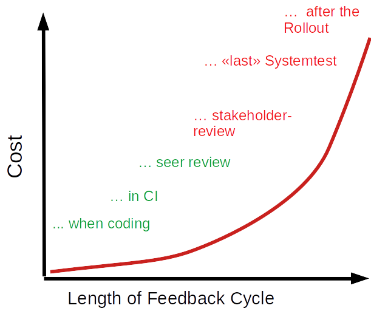

name: title
layout: true
class: center, middle, inverse

.footer[ [ @BernerDominik](https://twitter.com/BernerDominik)
         [ @doeme@tooting.ch](https://tooting.ch/@doeme)]

---

Brutally robust code with Design by Contract
===


#### Dominik Berner - Coder, Agilist, Rock Climber


???

# Begrüssung

## Code wird heute nicht nur einmal geschrieben, sondern auch in Zukunft oft wieder angefasst

## unerwünschte Nebeneffekte und Regression Bugs sind dabei natürlich unerwünscht. 

## Dummerweise werden die meisten Softwarefehler werden durch Programmierer

# Design by contract ist eine Software-Engineering-Praxis für besseren Code. 

# Intro - keine vertiefte analyse

# Überblick & Ablauf

---

# Good Code? 


???

Guter Code
* lässt die Absicht dahinter erkennen
* Falsche Verwendung durch Programmierer schwierig
* Korrekt - tut was er soll, in dem Kontext den er soll
* Kann gewartet werden
* lesbar 

--

.left[
```cpp
double squareroot(double x) {
  static constexpr int num_iterations = 101;
  if (x == 0)
    return 0;

  double guess = x;
  for (int i = 0; i < num_iterations; i++)
    guess -= (guess * guess - x) / (2 * guess);
  return guess;
}
```
]

???
## Newtonsches Wurzelziehen
Wert Konvergiert zum Ergebnis

# Ist das guter code?

## Sollte man ja eigentlich nicht selbst implementieren - Nur illustratives Beispiel 

13
7.46154
5.40603
5.01525
5.00002
5
5

--

### Hmmm...

* What about negative input? 
* Can it handle `NaN`?
* Maintainability? Refactoring and optimization?
* Should we replace that with a library function? 
* Error handling?

???

## Probleme hier: Negative zahlen? Performance optimierung = weniger iterationen = resultat falsch 

Fragen über Fragen, hier hilft design by contract

# Robuster code == Gegen regression bugs und falsche verwendung geschützt

# Hier hilft Design by Contract


---

# Design by Contract!

.left[
```cpp
double squareroot(double x) {
* Require(x >= 0); // <-- This is an assert
  static constexpr int num_iterations = 101;
  if (x == 0)
    return 0;

  double guess = x;
  for (int i = 0; i < num_iterations; i++)
    guess -= (guess * guess - x) / (2 * guess);
    
* Ensure(fabs(guess * guess - x) < \
*    numeric_limits<double>::epsilon()); // <-- Also an assert
  return guess;
}
```
]


???

# Assert

# wird der Vertrag verletzt, beendet das programm mit einem Fehler!

require handled Nan auch gleich, weil alle vergleiche mit NaN false sind

# Negative Zahlen Behandelt, NaN Behandelt
# Fehlerbehandlung dieser Fälle hat bitteschön ausserhalb zu geschehen
# Hardening gegen refactoring (auch im umliegenden kontext)

---


# Design by Contract?!

### "The 'Contract' is a methaphor for the relationship between the programmer as *'consumer'* and a software as a *'supplier'* of functionality.

???

# Was ist design by contract?

# Bertrand Meyer - Aus der programmiersprache eiffel 1986 erstmals in einem Artikel beschrieben

## Programmierer Werkzeug

## Fail early, fail hard

* KEINE Fehlermeldungen, diagnostics
* Informiert den Programmierer, nicht den benutzer

# Wie sieht ein korrekt implementiertes Programm in der Theoretischen Informatik aus?
# hoare Triple

 
---

# Theory Time! - Hoare Logic

### `{P}C{Q}` - If '`P`' then doing of '`C`' produces '`Q`' 

So our contract is 
### *require* that `P`, so that execution of `C` *ensures* `Q`

???

## Hoare-Logik ist ein formales System, um die Korrektheit von Programmen nachzuweisen

# Set von Regeln, die aussagen über Korrektheit von Software zu treffen

# Korrektheit - Verhält sich die Software wie sie soll, nicht ist das was sie tut sinnvoll

## Require und Ensure Schlüsselwörter design by contract

## Umgekehrt nicht gültig: Nur weil Q heisst nicht, dass P auch wahr ist

--

 |              | **Obligation**                     | **Benefit**                    |
 | ------------ | ---------------------------------- | ------------------------------ |
 | **Consumer** | *Has to fulfill precondition*      | *May expect the postcondition* |
 | **Supplier** | *Has to fulfill the postcondition* | *May expect the precondition*  |

???

# Wenn wir das als Vertrag auslegen: Muss und Darf 
# Beispiel Bier kaufen, Will bier, muss genug alt sein und genug geld haben sonst wasser.

---

# Example - Square root

 |              | **Obligation** | **Benefit**                                |
 | ------------ | -------------- | ------------------------------------------ |
 | **Consumer** | ?              | **Get the square root of the input value** |
 | **Supplier** | ?              | ?                                          |


???

# Ich will die Quadratwurzel des Eingabewerts kriegen
---

# Example - Square root

 |              | **Obligation**                            | **Benefit**                            |
 | ------------ | ----------------------------------------- | -------------------------------------- |
 | **Consumer** | ?                                         | Get the square root of the input value |
 | **Supplier** | **Calculate the square root (correctly)** | ?                                      |

???

# Der Supplier soll mir das liefern

# Unter allen Umständen???

---

# Example - Square root

 |              | **Obligation**                        | **Benefit**                            |
 | ------------ | ------------------------------------- | -------------------------------------- |
 | **Consumer** | **Input must be positive or 0**       | Get the square root of the input value |
 | **Supplier** | Calculate the square root (correctly) | ?                                      |

???

# Der Supplier soll mir das liefern

# Das gilt aber nur für positive Zahlen

---

# Example - Square root

 |              | **Obligation**                        | **Benefit**                            |
 | ------------ | ------------------------------------- | -------------------------------------- |
 | **Consumer** | Input must be positive or 0           | Get the square root of the input value |
 | **Supplier** | Calculate the square root (correctly) | **May ignore imaginary numbers**       |


???

# Supplier: weniger komplexität zu implementieren

--

.left[
```cpp
double squareroot(double x) {
* Require(x >= 0); // <-- This is an assert
  static constexpr int num_iterations = 101;
  if (x == 0)
    return 0;

  double guess = x;
  for (int i = 0; i < num_iterations; i++)
    guess -= (guess * guess - x) / (2 * guess);
    
* Ensure(fabs(guess * guess - x) < \
*    numeric_limits<double>::epsilon()); // <-- Also an assert
  return guess;
}
```
]

???

# Und Objektorientiert? 

---

# A class hardedend by Contracts

.left[
```cpp
class UniqueIntList {
public:
  void add(int element);

  int get_element_at(size_t idx) const; 

  bool has_element(int element) const;
  
  size_t capacity() const;

  size_t count() const; 

};
```
]

???

# Beispiel, Liste mit einmaligen werden (Macht das nicht selbst!)

# Entweder aufwändige Fehlerbehandlung ODER absicherung mit contracts

# Benutzer soll schauen, dass die Werte einmaligs sind

---

# A class hardedend by Contracts

.left[
```cpp
class UniqueIntList {
public:
  void add(int element) {
*   Require(!has_element(element));
    list_.emplace_back(element);
*   Ensure(has_element(element));
*   Invariant(count() <= capacity());
  }

  int get_element_at(size_t idx) const {
*   Require(idx < count());
    return list_[idx];
  }

  bool has_element(int element) const {
    return std::find(list_.begin(), list_.end(), element) \
      != list_.end();
  }
  size_t capacity() const { return list_.capacity(); }
  size_t count() const { return list_.size(); }

private:
  vector<int> list_;
};
```
]

???

# Mit code befüllt

## Invarianten: Garantieren konsitenten Objektzustand zwischen ausführungen von public Methoden

## Was passiert bei Vererbung?

---

# Inherited Contracts

.left[
* **Invariants** are retained
* **Preconditions** May be weakended, but not strengthened
* **Postconditions** may be strengthened, but not weakened

]

???

# Erbende Klassen müssen Verträge der Eltern erfüllen. 

# Das ist eigentlich schon das meiste. Require, Ensure, Invariant

---

# How to use in practice?
.left[
* Native support in some languages (Eiffel, D, Kotlin, Rust...)
* Maybe in ~~C++20~~ C++23
* C++ Support through external libraries like Boost.Contract, Loki
* Own trivial implementation as "`contract`" is an `assert`
]

???

# triviale Umsetzung mit Asserts, boost.contract

--

.left[
```cpp
#include <cassert>
#define Require assert
#define Ensure assert
#define Invariant assert
```
]

Example: [https://github.com/bernedom/bertrand/](https://github.com/bernedom/bertrand/)

???

# Wichtig: Contracts gehören nicht in produktiven code!

* Weitere Elemente z.b. Text zum Contract und Stack Traces
* Einfacher Einbau in bestehenden Code

---

# Typical examples in practice
.left[
* Require(ptr != nullptr)
* Order of call z.b. init() before run() before reset()
* Only "owner"-Thread may change a statemachine 
* Only normalized float values accepted i.e. [-1.0, 1.0] 
* Resource (z.b. File) does exist
* Is stuff that we are using initialized?
* Data consistence in classes und structs
* Unreachable defaults in `switch` statements
* ...

]

???

# Ein paar typische Beispiele 

# Wie passt das in unseren Entwicklungszyklus?

---

# Find defects earlier!...


???

* Agile cost of change
* Hier kommt das "Design" 
* Explizites Ausrücken der Gedanken erleichtert diskussion
* Umsetzung von "Fail early fail hard" bzw. Stop and Fix
* 10% Mehr Fehler im Grünen bereich bringt schon viel! 

* Komplexität des Codes wird reduziert
* Weniger Code, Weniger Bugs

---

# Design By Contract und Software Quality


???

Dbc - Korrekte verwendung der Software
Unittesting - Verhält sich die Software korrekt
Dokumentation - Wie verwende ich das richtig

DbC ersetzt (unit) testen nicht, sondern komplementiert
Tests werden simpler, weil edge cases anders abgefangen

Wenn contracts failen, soll nicht getestet werden

## Formale Spezifikation im Code - Regulatorisch interessant

# Probiert das aus! Die Hürde ist klein und ihr werdet schnell eine Verbesserung feststellen

---

# Q & A

.left-column[
 
]
.right-column[
.left[
[ dominikberner.me](http://dominikberner.me)

[ @BernerDominik](https://twitter.com/BernerDominik)

[ @doeme@tooting.ch](https://tooting.ch/@doeme)

[ bernedom](https://github.com/bernedom)

[ dominik.berner@wingtra.ch](mailto:dominik.berner@wingtra.ch)
]
]

---

Notizen / Backup

???


Vertraglich zugesicherte Code-Robustheit
Robuster, Lesbarer Code mit Design by Contract

100% der Softwarefehler werden vom Programmierer verursacht. Testen und Code Reviews helfen zwar, sind aber nicht genug. Viel schöner wäre es, wenn ich als Programmierer eine falsche Verwendung meines Codes von vornherein Abfangen könnte. Mit "Design by Contract" kriegen wir ein Werkzeug für genau diesen Zweck in die Hände. Aber nicht nur die Korrektheit, sondern auch die Lesbarkeit, Wartbarkeit und Robustheit des Codes wird damit erhöht. Ab C++20 ist dieses Konzept endlich auch "nativ" in C++ verfügbar, aber auch heute lässt es sich schon mit wenig Aufwand anwenden. Wie funktioniert dieses Konzept? Wie setze ich es um? Und welchen Einfluss hat das auf das Testing? In diesem Vortrag werden die Antworten auf diese und weitere Fragen ausführlich erläutert. 
 

Gliederung
* Was heisst Design by Contract?
* Wie setzte ich das mit C++ in der Praxis um?
* Wie sieht das C++20 vor?
* Wie spielt dies mit meinem Testing zusammen? 

Benefit und Besonderheiten
Die Teilnehmer erhalten eine Einführung in "Design by Contract" sowie konkrete Hinweise zur Anwendung in bestehendem C++ Code. Nebst der Anwendung auf kleiner Stufe wird der Einsatz im kompletten Entwicklungszyklus besprochen. Die Teilnehmer erhalten die Möglichkeit Fragen zum Konzept von "Design by Contract" zu stellen und das Konzept kritisch zu diskutieren.

Über den Referenten
	
Dominik Berner ist ein Senior Software-Ingenieur bei der bbv Software Services AG mit einer Leidenschaft für modernes C++. Die Wartbarkeit von Code ist für ihn kein Nebeneffekt, sondern ein primäres Qualitätsmerkmal das für die Entwicklung von langlebiger Software unabdingbar ist. Als Blogger und Speaker and Konferenzen und Meetups weiss er wie Inhalte zu verpacken sind, damit für das Publikum ein Mehrwert entsteht.

http://docplayer.org/4165643-Design-by-contract-in-java.html