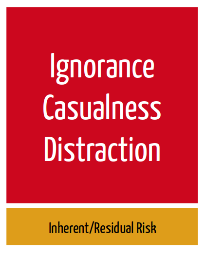

name: title
layout: true
class: center, top, inverse
background-position: center
background-repeat: no-repeat
background-size: contain

.footer[ [ @BernerDominik](https://twitter.com/BernerDominik)]
---
class: center, middle, inverse
background-image: url(images/gletscher.jpg)

# The Mountain Mind
# How we fail an take risks

### Dominik Berner - Software Engineer, Agilist, Rock Climber

???

# Guten Morgen mitenander

Only those who will risk going too far can possibly find out how far they can go. ~T.S. Eliot

Oder: Man muss wissen wie weit man zu weit gehen kann

---
background-image: url(images/early_sunrise.jpg)
# Let's go
???

# Stellt euch vor...

Gestern losgegangen in die Hüttte die besorgte freundin noch "seid ihr sicher, dass ihr das packt?" Heute Vor sonnenaufgang los, frühstück, zustieg, sonnenaufgang, ein paar Seillängen geklettert alles OK. 

oder anders: 

Software, aquisegespräch, offerte raus, SUM fragt seid ihr sicher, dass ihr das packt? Erstes Projekt setup, erste refinement and review meetings, und jetzt gehts ans eingemachte. 

---
background-image: url(images/committed.jpg)
# "What if you fa(i)ll?"

???

Doch nun gilts ernst "Ab hier kein Zurück mehr". Und in der steilwand, schaut man sich an und sagt sich, wenn wir hier Weiterklettern ist schluss mit abseilen. Dann müssen wir oben raus. 

 Jetzt wirds schwierig, es steht eine z.b architekturentscheidung an die nur schwer Rückgängig gemacht werden kann. Oder dieses eine Feature, dass man nicht so genau weiss wie umsetzen, aber wenns klappt ist das Produkt der Hammer. 

Und? Könnt ihr euch hier committen? Fragt der Scrum Master im Planning meeting? 

* Was heisst committed sein? 

Übersetzt "Bindung", Engagement aber auch Hingabe, Verpflichtung. 
Erscheint uns etwas einfach und ist der Weg klar, fällt uns die Entscheidung oft einfach.

* Committed sein bedeutet involvement. Auf dem Berg ist man erst "Committed" wenn man bereits voll drin steckt. 
* Committed sein heisst: Ich will da rauf, und ich bin bereit dafür zu "beissen"
* Committed sein heisst nicht, ich will das tun. Sondern, ich tue das
* Committment hat etwas finales und bedeutet vollen fokus auf etwas. Halbpatziges Commitment ist nichts

---
background-image: url(images/committed.jpg)

???

Das ist das was wir gerne möchten. So macht es nämlich auch spass, so können wir mitgestalten, so können wir echt etwas herausholen. 
Wir wollen an den Punkt kommen, wo wir sagen ich weiss noch nicht wie." Nun möchten wir aber nicht verzagen sondern sagen können "bin zuversichtlich, dass ich das mit meinem Team schaffe." Wie kommen wir dahin? 

Aber: Je höher die kosten für uns selbst, desto schwieriger fällt uns das. Bis zu dem Moment, bei dem wir uns nicht mehr committen wollen. 

Kenne ich eine Kletterroute schon oder habe ich eine Feature schon mal ganz ähnlich implementiert fällt mir das committment oft einfach. 
Spannend wird es dort, wo wir uns auf Neuland begeben. 

Dort wo wir in der Situation sind, dass wir sagen"

* Das Ziel kennen wir, den Weg dahin nur begrenzt

---
background-image: url(images/rega.jpg)
# Why do accidents happen?

???

Diese Risiken kriegen wir nicht weg, sie sind Systembedingt. Beim Bergsteigen kann ich Steinschlag ausgesetzt sein. 
Beim Programmieren kann eine kritische Sicherheitslücke erscheinen
Der Kunde kann in Finanznot geraten und das Projekt killen

---
background-image: url(images/rega.jpg)
# Why do accidents happen?

.credit[  [From "Staying alive" by John Dill of the YSAR ](http://www.bluebison.net/yosar/alive.htm)]

???

Darauf setzen wir die "Hausgemachten" risiken drauf. 

* Ignorance: Wir wissen/können einfach zu wenig
* Casualness: Wir unterschätzen die Situation, denken es sei easy
* Distraction: Wir verzetteln uns - Das heisst wir sind nicht committed

Was hilft:
Ignorance? Training, Erfahrung
Casualness: Reflektieren, System awareness, Kontext beobachten
Distraction: Committment - Fokus

---
background-image: url(images/runterkommen.jpeg)
# Getting back to safe ground!

???

Darauf setzen wir die "Hausgemachten" risiken drauf. 

* Ignorance: Wir wissen/können einfach zu wenig
* Casualness: Wir unterschätzen die Situation, denken es sei easy
* Distraction: Wir verzetteln uns - Das heisst wir sind nicht committed

Was hilft:
Ignorance? Training, Erfahrung
Casualness: Reflektieren, System awareness, Kontext beobachten
Distraction: Committment - Fokus

---
background-image: url(images/runterkommen.jpeg)
# Getting back to safe ground!

.fat[

* Get back to safety!
* Reflect - What happened?
* Learn - What can we do better next time?
]

???

Darauf setzen wir die "Hausgemachten" risiken drauf. 

* Ignorance: Wir wissen/können einfach zu wenig
* Casualness: Wir unterschätzen die Situation, denken es sei easy
* Distraction: Wir verzetteln uns - Das heisst wir sind nicht committed

Was hilft:
Ignorance? Training, Erfahrung
Casualness: Reflektieren, System awareness, Kontext beobachten
Distraction: Committment - Fokus

---
background-image: url(images/safety.jpg)
# Get confident in your safety measures

## Take a break and breathe!

???

Darauf setzen wir die "Hausgemachten" risiken drauf. 

* Ignorance: Wir wissen/können einfach zu wenig
* Casualness: Wir unterschätzen die Situation, denken es sei easy
* Distraction: Wir verzetteln uns - Das heisst wir sind nicht committed

Was hilft:
Ignorance? Training, Erfahrung
Casualness: Reflektieren, System awareness, Kontext beobachten
Distraction: Committment - Fokus

---
background-image: url(images/celebrate_success.jpg)
# Do it all again and suceeed!

