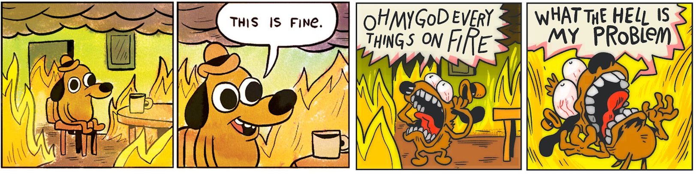

name: title
layout: true
class: center, top, inverse
background-position: center
background-repeat: no-repeat
background-size: contain

.footer[ [ @BernerDominik](https://twitter.com/BernerDominik)]
---
class: center, middle, inverse
background-image: url(images/gletscher.jpg)

# The Mountain Mind
# Dare to commit yourself

### Dominik Berner - Software Engineer, Agilist, Rock Climber

 

???

# Guten Morgen mitenander

Only those who will risk going too far can possibly find out how far they can go. ~T.S. Eliot

Oder: Man muss wissen wie weit man zu weit gehen kann

# kurze vorstellung 

Dominik, Bergsteigen als Hobby, SW als Beruf

---
background-image: url(images/early_sunrise.jpg)
# Los geht's!
???

# Stellt euch vor...

Gestern losgegangen in die Hüttte, die Partnerin oder der Partner frag noch "seid ihr sicher, dass ihr das packt?" Heute Vor sonnenaufgang los, frühstück, zustieg, sonnenaufgang, ein paar Seillängen geklettert alles OK. 

oder anders: 

Software, aquisegespräch, offerte raus, CEO fragt seid ihr sicher, dass ihr das packt? Erstes Projekt setup, erste refinement and review meetings, und jetzt gehts ans eingemachte. 

---
background-image: url(images/committed.jpg)
# "Committed sein"

???

Doch nun gilts ernst "Ab hier kein Zurück mehr". Und in der steilwand, schaut man sich an und sagt sich, wenn wir hier Weiterklettern ist schluss mit abseilen. Dann müssen wir oben raus.  - Wir sind nun committed, voll in der Route drin. 

Jetzt wirds schwierig, es steht eine z.b architekturentscheidung an die nur schwer Rückgängig gemacht werden kann. Oder dieses eine Feature, dass man nicht so genau weiss wie umsetzen, aber wenns klappt ist das Produkt der Hammer. Oder das Produkt wird das erste mal beim Kunden ausprobiert etc. 

Und? Könnt ihr euch hier committen? Fragt der Scrum Master im Planning meeting? 

---
background-image: url(images/nebel.jpg)
# "Committed sein heisst beissen"

???

# Was heisst committed sein? 

Übersetzt "Bindung", Engagement aber auch Hingabe, Verpflichtung. 
Erscheint uns etwas einfach und ist der Weg klar, fällt uns die Entscheidung oft einfach.

* Committed sein bedeutet involvement. Auf dem Berg ist man erst "Committed" wenn man bereits voll drin steckt. 
* Committed sein heisst: Ich will da rauf, und ich bin bereit dafür zu "beissen"
* Committed sein heisst nicht, ich will das tun. Sondern, ich tue das
* Committment hat etwas finales und bedeutet vollen fokus auf etwas. Halbpatziges Commitment ist nichts

---
background-image: url(images/nebel.jpg)
# "Committment heisst Verantwortung"

.fat[ “The committed person doesn’t play by the rules of the game. He is responsible for the game."

Peter Senge ]

???

# d.h. Committed sein heisst auch Verantwortung übernehmen

Das ist das was wir gerne möchten. So macht es nämlich auch spass, so können wir mitgestalten, so können wir echt etwas herausholen. 
Wir wollen an den Punkt kommen, wo wir sagen ich weiss noch nicht wie." Nun möchten wir aber nicht verzagen sondern sagen können "bin zuversichtlich, dass ich das mit meinem Team schaffe." Wie kommen wir dahin? 

Aber: Je höher die kosten für uns selbst, desto schwieriger fällt uns das. Bis zu dem Moment, bei dem wir uns nicht mehr committen wollen. 

Kenne ich eine Kletterroute schon oder habe ich eine Feature schon mal ganz ähnlich implementiert fällt mir das committment oft einfach. 
Spannend wird es dort, wo wir uns auf Neuland begeben. 

Die grosse Frage, ist "traue ich mir das zu?" bzw. traue ich das meinem Team zu? Oder auch traue ich das DIESEM Team zu?

---

# Committment und Risiko

### Die Riskowahrnehmung ist oft subjektiv

.center[]

???

Risiko ist subjektiv. "Risiko ist die Angst dass es schief gehen könnte."

aber ich habe versprochen Über comittment und Zuversicht zu sprechen. 
Zuversicht ist das Schmerzmittel zur Risikowahrnehmung

---
background-image: url(images/rega.jpg)
# Risikofaktoren = Gründe für Fehlschläge

???

Diese Risiken kriegen wir nicht weg, sie sind Systembedingt. Beim Bergsteigen kann ich Steinschlag ausgesetzt sein. 
Beim Programmieren kann eine kritische Sicherheitslücke erscheinen
Der Kunde kann in Finanznot geraten und das Projekt killen

# Diese Risiken sind oft klein

---
background-image: url(images/rega.jpg)
# Risikofaktoren = Gründe für Fehlschläge

???

Darauf setzen wir die "Hausgemachten" risiken drauf. 

* Ignorance: Wir wissen/können einfach zu wenig
* Casualness: Wir unterschätzen die Situation, denken es sei easy
* Distraction: Wir verzetteln uns - Das heisst wir sind nicht committed

Was hilft:
Ignorance? Training, Erfahrung
Casualness: Reflektieren, System awareness, Kontext beobachten
Distraction: Committment - Fokus

---
background-image: url(images/schnee-aufstieg.jpg)
# Risiko und Commitment

???

Grosses wahrgenommenes Risiko führt dazu, dass wir uns nicht committen wollen

Niedriges Commitment führt dazu, dass wir das was wir tun als Risikobehaftet einschätzen, weil wir das "spiel" nicht gestalten wollen/können

Dies verhindert wieder commitment und so weiter. Oder auch anders rum, ist das Risiko klein fällt es uns leicht uns zu committen. Sind wir voll drin, laufen wir gefahr alles zu schaffen (Kanns geben)

---
background-image: url(images/schnee-aufstieg.jpg)
# Risiko und Commitment

???

Als stellgrössen, Skills/Training, System awareness
sowie Fokus und involvment

Beim Klettern, Kletterhalle, Ernsthaftigkeit der Route, Team kollegen etc. Und das committment kommt wenn wir dabei sind

Beim Arbeiten, Ingenierusarbeit, Kontext, "Warum"

---
background-image: url(images/safety.jpg)
# Sicherheit schaffen - Fokus erhöhen

???

Fokus und Involvment erhöhen. Ja ich will das, ich trau mich das. - Z.b. Nicht alleine gehen. Team kennen - Distraction reduzieren. "Ich würde ja, wenn ich könnte - Fokus auf die Risikobehafteten Situationen lenken, bewusst einsteigen"

SKill level - Ich kann das, oder ich hab Leute um mich herum die das können. 
System Context - Ich weiss was um mich herum geschieht, ich kann die Situation einschätzen. Ich weiss wie viel spatzig wir haben

---
background-image: url(images/flow.jpg)
# in den Flow kommen

???

Wenn alles zusammen spielt kommen wir in den Flow. Lange strecken von hoher konzentration und Leistungsfähigkeit. Dann wirds auch wenns mal gefährlicher wird spannend. 

- Dann fass ich mir ein HErz un überkletter die Schwierige Stelle. Ich kann das mobilisieren. Oftmals mit Anfeuern vom Kletterpartner
- Dann wage ich mich an ein Projekt mit unsicherheiten. Weil ich weiss, dass ich den nötigen Fokus aufbringen kann. Weil meine Kollegen schlau sind und gut ausgebildet. Weil ich mit meinem Mandatsleiter den Kontext schaffen kann - z.b. Ist ein Absturz Lebensgefährlich oder nur sehr unangenehm? Geht die bbv kaputt, wenn wir das Projekt versemmeln? 

Man muss sich diese Umgebung schaffen. 

Wenn das stimmt, dann kann man sich an die grossen Berge wagen. Dann ist Bergsteigen und Softwareentwicklung nicht einfach nur ein teures, gefährliches wagniss, sondern ein Lustvolles Abenteuer, bei dem absolut unglaubliche Momente entstehen können. 

---
background-image: url(images/sunset.jpg)
# Vielen Dank

???

Und dann schaut man am Abend oder am Projektende auf wirklich coole Arbeit zurück. Nicht nur auf ein Spannendes ergebnis, sondern auch darauf dass der Weg dahin exzellent war. 

Aber Bevor wir vom Abend sprechen, geniesst das weitere Programm. 

Vielen Dank fürs Zuhören

---
class: left, middle
# Dominik Berner

### C++ Coder, Agilist & Rock Climber

[ softwarecraft.ch](http://softwarecraft.ch)

[ @BernerDominik](https://twitter.com/BernerDominik)

[ bernedom](https://github.com/bernedom)

[ dominik.berner@wingtra.com](mailto:dominik.berner@wingtra.com)
 

---

